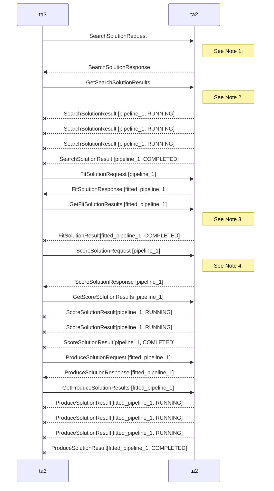
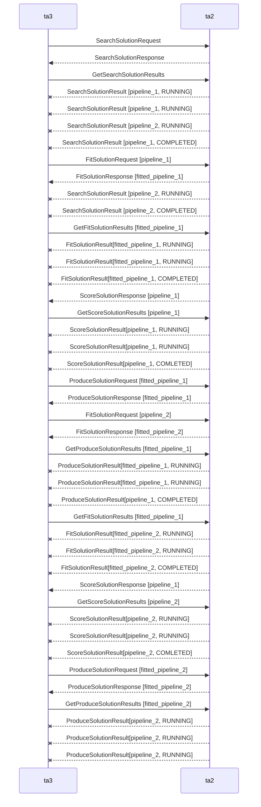

Current TA2/TA3 Message Flow
===================

The system is currently compliant with the API, but doesn't really do its internal processing in a manner that is compliant with the API.  Our current behviour is as follows:

Note 1:
At this point we kick off the `exline_task` which creates the pipeline and immediately starts to fit it.

Note 2:
We send back `RUNNING` messages until the fit in `exline_task` completes.

Note 3:
Given that the fit was already completed when `exline_task` ran, we immediately return `COMPLETED` on the fit related calls.

Note 4:
The score request takes solution ID as an argument, not a fitted solution ID, which means that it can technically be invoked without the pipeline being fitted.  This is not possible in our current arrangement because we fit as part of search, but it would need to be addressed.

Expected TA2/TA3 Message Flow
=============================

